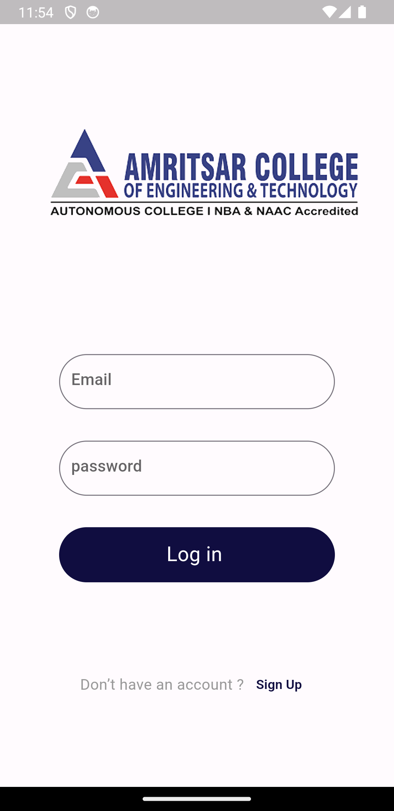

# Nepal SA - Nepali Student Association Messaging App

Nepal SA is a messaging app designed for Nepali students at Amritsir College of Engineering and Technology, providing a platform for group communication among Nepali students and NSA (Nepali Student Association) members. This README file provides essential information for users of the Nepal SA app.

# Features

#Group Chatting: Connect with fellow Nepali students and NSA members through group chat, enabling mass communication for important updates and discussions.

#Authentication: Secure user authentication ensures the privacy and integrity of your messages.

#Login, Signup, Signout: Easy-to-use login and signup processes, along with the ability to sign out when needed.

Download the App: right now app is in a testing phase once it has all the features You can download the Nepal SA app from the App Store or Google Play Store, depending on your device.

#Authentication

When you first open the app, you will be prompted to log in or sign up.

If you are a new user, click "Signup" and provide the required information to create an account.

If you are an existing user, simply enter your login credentials and click "Login."

Usage

# Login
Use your registered email and password to log in to the app.

# Signup
If you are a new user, click on "Signup" and fill in the required details to create an account.
Home Screen
After logging in, you will be directed to the  group chats.

# Messaging
Send and receive messages within the group chat.

# Signout
To log out of the app, go to the settings or profile section and select "Sign Out."
Future Enhancements
In future versions of Nepal SA, we plan to implement the following features:

Private messaging between users.

Multimedia support (images, videos, files) in messages.

Notifications for important updates and messages.

User profiles and customizable avatars.

We are committed to improving the app to meet the evolving needs of Nepali students at Amritsir College of Engineering and Technology.

#Contributing
If you are interested in contributing to Nepal SA, please follow our contribution guidelines.

if you have any idea about the improvement of app then please inform me and you can also improve the app by yourself your help is kindly accepted.